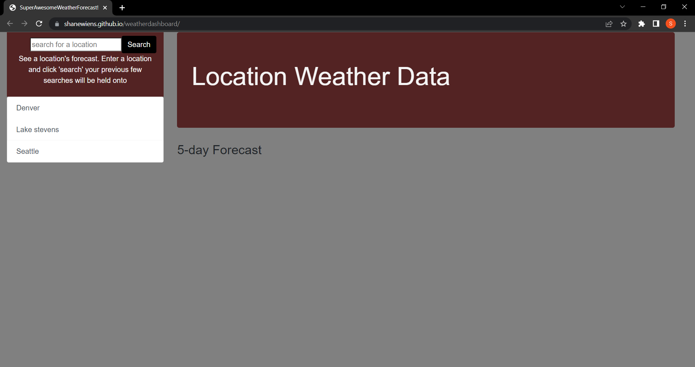

## WeatherDashboard
It's an application allowing a user to enter a location into a search and get the weather information for the next 5 days. Searches are saved for late use and quick access.



## Technologies
* HTML
* CSS
* JavaScript
* OpenWeather API
* Bootstraps API

## User Story
```
AS A USER
I WANT to be able to search for a location
SO THAT I can see weather information there
```
## License
* MIT